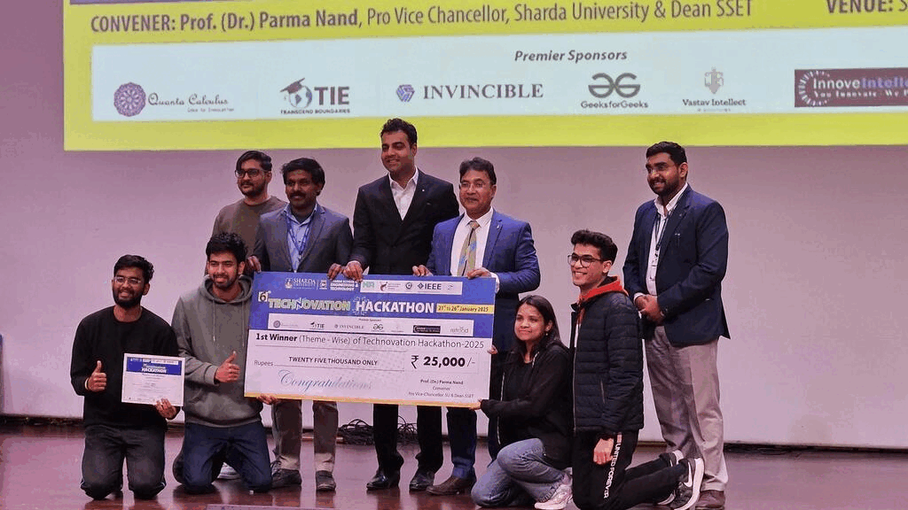

*ml/ai intern @[imagined studios](https://imagined.studio/), researcher and senior @IIIT-Delhi'25. 🌱*

----

* my research interests are NLP, LLMs, Information Retrieval, and CV.
  
* most of my learnings are from either hands-on projects that i build in hackathons or from interesting courses taught at my university.
  
* tags: problem solver, clear comms, good vibes only.
  
----

----

<!-- 

 -->

 

  

